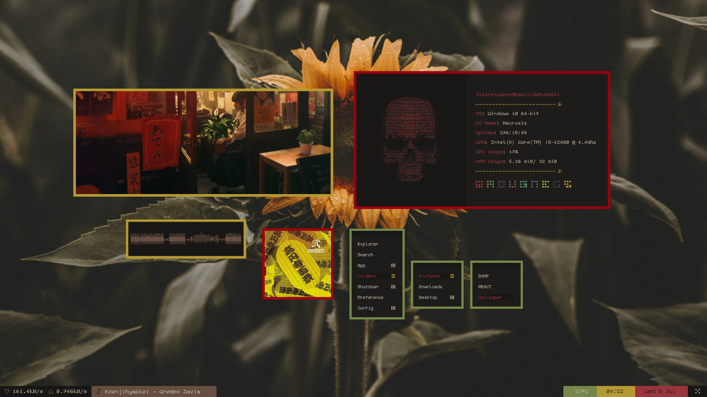
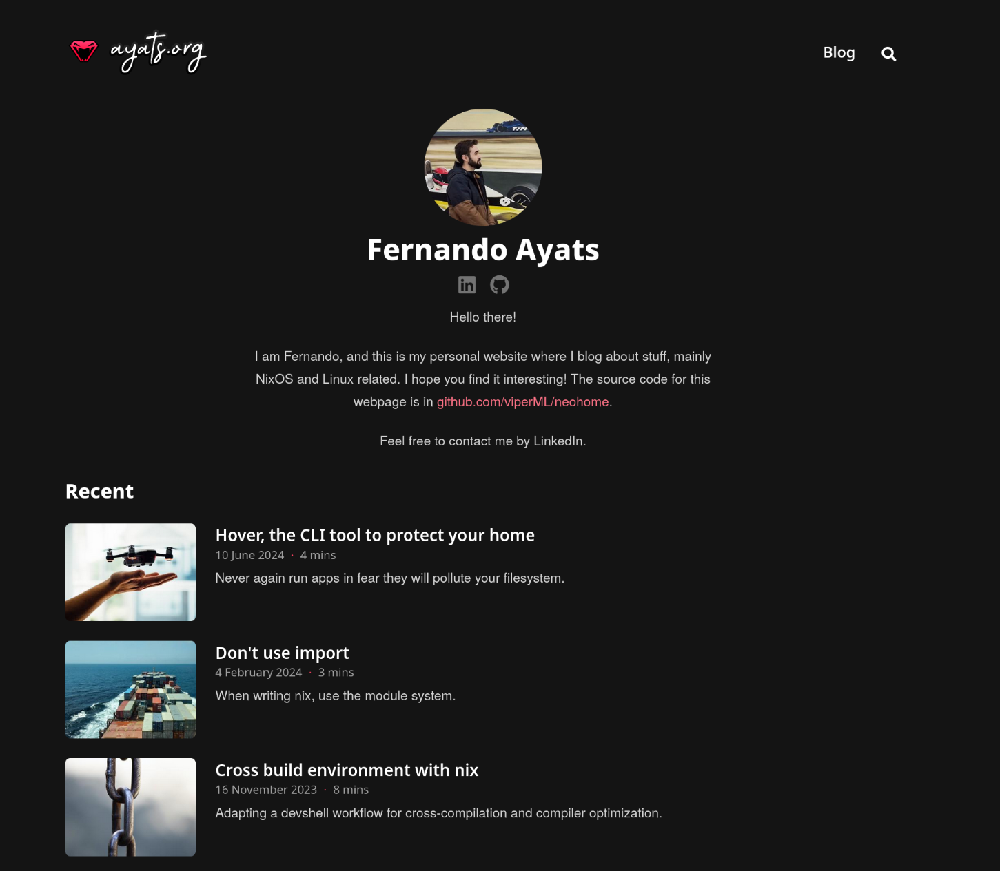

I want to start with a little tangent, to set up the background for this
story...

My interest for computers started back in high school, when I was given an HP
Pavilion G7. With its dual-core AMD CPU and 1600x900 screen, it was not the top
PC experience you could have, but for my younger self, it was fantastic.

I could spend hours just browsing through the UI, playing games, modding them,
and much more. I ran the default Windows (8?) installation back them. **What else,
of course**. I knew macOS was a thing, as some familiars had those machines. But
in my journeys going through the Windows UI, I wanted to get a better
experience.

It was back them I discovered "desktop ricing", what people called to
personalizing their desktop experience. The trend back then was having a very
minimalistic interface, with flat borders and without buttons. (Looking back into
it, not having tools to make anything fancier may be the reason why minimalistic
looks were the trend).



I also wanted to do something like this for my laptop. Having a "cool" design,
that were radically different from the default Windows UI -- but still being
functional to use. As you can imagine, there were some tools to modify the
system resources. But as much as apply some paint and coating, the essence is
still the same.

So, as a natural consequence, my eyes started to look into Linux. This "Free"
-- as in freedom --
operating system, where you can modify any visual aspect of it. I didn't really
want to deal with systemd or the package manages, those were just tools to
having my aesthetically-pleasing desktop experience. So after what every Linux
started does -- research for hours and hours which distro to use -- I finally
landed in Manjaro.

I can't find any screenshot of my desktop back then, so we will have to
settle with this one from an Arch installation, from some months after:


Time passed, and I moved into other things. Mainly, moved into investigating how
Linux really works. But in the back of my head, I still had this interest with
**interface design**. And as we are in 2024, the world has moved on to the Web.

## My old blog

At some point, a confluence of interests was met: designing a good-looking
interface, and telling stories about Nix. If you follow my blog, you probably
already know what Nix -- I won't rant about it today.

After doing some investigation about how to create my own page, I landed on
[Congo](https://github.com/jpanther/congo). This is a template, that was made for
[Hugo](https://gohugo.io), a static site generator (more onto that later). After
some tweaking of the template, I got it to suit my taste.



### Hugo

Hugo is a static site generator written in Go. As a high level overview, it
takes your source files, runs a templating engine on top of them, and returns
your static site.

The key to Hugo is its templating engine. I didn't look too far in the specific
implementation, but I believe they use the
[`text/template`](https://pkg.go.dev/text/template) package, which seems to be
very popular among Go ecoystem. The templating engine is applied over regular HTML,
which is constructed by joining multiple templates or "partials".

As an example, this "partial" built a part of the navigation bar:

```html file: "partial-logo.html"
```

This example shows my main reason to move away from Hugo: **I didn't want to
deal with this templating language**. It's just not my cup of tea.
First of all, this is not proper HTML, and the editor tools were not good back
then.
But I am sure there is people that praise 
this templating language, even for
other contexts -- I have personally used with
[consul-template](https://github.com/hashicorp/consul-template). But I don't
want to deal with a "pseudo-language", with if-blocks, variables etc. I would
rather use a more "orthodox" language, with editor support, types, and whatever
you would expect from a multipurpose language in this time and age.

In any case, another reason to stop using Hugo emerged: actually understanding
how the web technologies work. And for that, I don't want to deal with any
"higher level" templating engines, I want to go the root.


## My requirements for a new framework

Again, I started to look at the landscape of options to build a web page. This
time, with closer look. Options were many, but I also discarded many quickly.
My main criteria were:

- No backend: I only want to host static files on [Cloudflare Pages](https://pages.cloudflare.com).
- No weird HTML templating DSL: this discards Rust's solution, [Zola](https://www.getzola.org).
- Uses a familiar enough language for me: discards Haskell's solution, [Hakyll](https://jaspervdj.be/hakyll).

Looking into the JavaScript-based solutions can be daunting at first. The
solution that picked my interest from the start -- and the final decision -- was Astro.
A friend of mine was already using it, so no better reason than peer pressure. 
He had a good experience, so I
decided to give it a try.

### Some words about Astro

The [Astro webpage](https://astro.build) describes it as a "web framework for
content-driven websites". You can find many explanations on the internet about
how Astro works, but here is my take as a list of the key features:

- Much like [Pandoc](https://pandoc.org), Astro takes Markdown files as input,
and outputs some HTML.
- Starting from plain HTML+CSS, statically served.
- Astro "code fences" let you generate the HTML programmatically, for example:
    ```astro
    ---
    // This is JavaScript
    const text = "foo" + "bar";
    ---
    <!-- This a Component template (HTML+{JS}) -->
    <p>{text}<p>
    ```
- A standard library that can handle content collections for you (a folder with
a bunch of markdown files).

In the end, Astro provides me with a solution that lets me write my HTML and
CSS, while also handling the "boring stuff" of parsing all the markdown files.
In retrospect, I might be able to it myself, but I don't really have the time
for that.

As a side effect of using JavaScript, I also get access to some cool libraries
from the NPM ecosystem. I think it is pretty obvious to say, that you will find
the most amount of libraries to handle HTML, in the JS ecosystem.

Some of these libraries are:

- Rehype and remark: HTML and Markdown parser, with a plugin interface to
augment their capabilities.
- RSS feed generator: from Astro itself, but distributed as a separate library.
- Less: a language that compiles to CSS
- SVG icons: one `npm install` away


## Finale

To sum up: my blog used a template system that I didn't enjoy. In the process 
of rewriting it to using the
Astro framework, I learned about basic web technologies, like HTML, CSS and JS.

I hope my design decisions were interesting. Please stay tuned for more updates.
As you can guess by my enthusiasm, I have more things to say about this webpage
revamp, such as including some Rust in the build pipeline...


